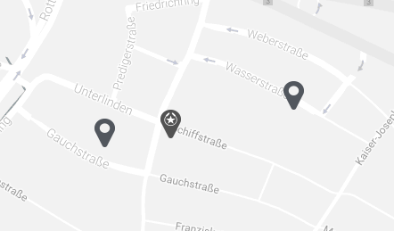
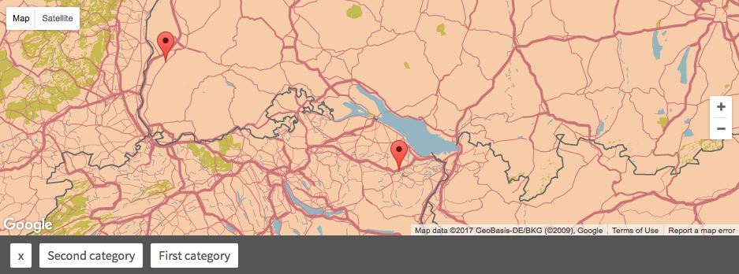

.. ==================================================
.. FOR YOUR INFORMATION
.. --------------------------------------------------
.. -*- coding: utf-8 -*- with BOM.

.. include:: Includes.txt

.. _for-administrators:

For Administrators
==================

This chapter describes the use of the extension from a adminstrators point of view.
For a editors point of view, check out the 'For Editors' Chapter.

Extension Configuration
-----------------------

Location Manager provides a number of settings in the Extension Configuration located in the Extension Manager.
These options can be used to enable or disable certain functionality for your editor.

API Key
^^^^^^^

Allows specifying an API Key for Google Maps.
While this is not necessary during the development process, it is vital to set an API Key once the Website hits production
to ensure a consistent user experience without hitting Googles API Limits.

To get an API Key, open the `Google Developers Console`_, create a new Project (if necessary), ensure that the necessary
APIs are selected under `Library` and retrieve the API Key under `Credentials`. The Key may be titled `Browser Key`.

The necessary APIs include:

- Google Maps JavaScript API
- Google Maps Geocoding API

.. _Google Developers Console: https://console.developers.google.com

Return arrays instead of extbase objects
^^^^^^^^^^^^^^^^^^^^^^^^^^^^^^^^^^^^^^^^

Uses lightweight arrays with primitive values instead of full Extbase Objects that are resolved through the ORM.
Use this option if you have a lot of locations and hit performance and/or scalability problems.
Note, that side-effects may be visible after enabling this option.

Enable custom maker images in categories
^^^^^^^^^^^^^^^^^^^^^^^^^^^^^^^^^^^^^^^^

Adds an option to sys_categories to specify an image which will be used as marker.
All Locations that have a relation to this Category will use that marker.
This can be helpful to ensure visual differences between different types of locations.

    Example of using a custom marker image to highlight one location over others

Enable the use of separate categories for the filter
^^^^^^^^^^^^^^^^^^^^^^^^^^^^^^^^^^^^^^^^^^^^^^^^^^^^

Adds a second category selection box to locations, to allow for category selection in the filter that differ from
regular categories.

Advanced Plugin Settings
------------------------

Custom Google Maps style array
^^^^^^^^^^^^^^^^^^^^^^^^^^^^^^

Allows styling of the map using googles own JSON-styling markup.
Examples for custom map styles can be seen on the website snazzymaps_.
Please ensure, that the style array is pasted into the textarea completely and does not include any whitespace before
or after it.

.. _snazzymaps: https://snazzymaps.com/

    Example of a custom map style
