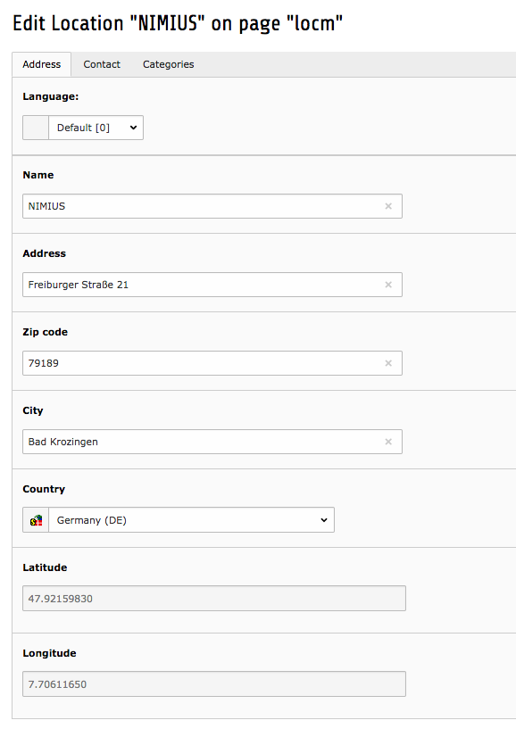
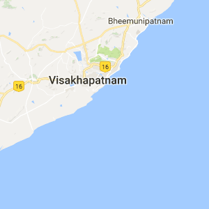
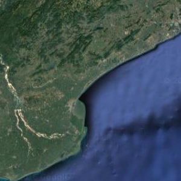
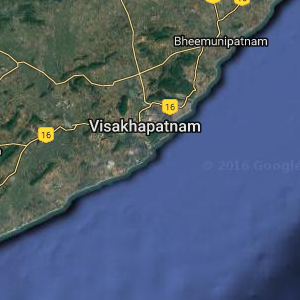
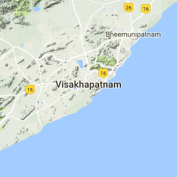
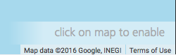
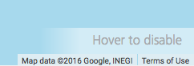
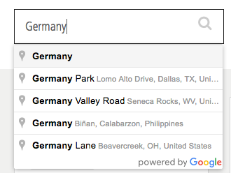

.. ==================================================
.. FOR YOUR INFORMATION
.. --------------------------------------------------
.. -*- coding: utf-8 -*- with BOM.

.. include:: Includes.txt

.. _for-editors:

For Editors
============

This chapter describes the use of the extension from a users point of view.
For more indepth administrators and/or developers point of view take a look at the Administrators manual.

Creating Locations
------------------

Location records are the basis of location_manager. Use the `List Module`_ to create a new Location.
Every location needs the following information:

- A name
- An address which can consist out of Street, Number, ZIP-Code, City and Country
- Coordinates (Coordinates are automatically fetched based on the address when saving a record, if the extension geocoding_ is installed)

Additionally the following information may be set

- Multiple Phone Numbers
- Multiple Fax Numbers
- Multiple E-Mail Adresses
- URL
- Categories of the Location

    Editing Interface for a Location

.. _List Module: https://docs.typo3.org/typo3cms/GettingStartedTutorial/ListModule/Index.html
.. _geocoding: https://typo3.org/extensions/repository/view/geocoding

Plugin Setup
------------

The main Frontend can be added to a site by using the `Location Manager` Plugin.
This will render a dynamic list of the created locations as well as a map containing those locations.
The following settings are available:

Map Type
^^^^^^^^

Allows the selection of the type of map that will be rendered.
The following types are available:

+-----------+-------------+----------+-----------+
| Roadmap   | Satellite   | Hybrid   | Terrain   |
+===========+=============+==========+===========+
| |roadmap| | |satellite| | |hybrid| | |terrain| |
+-----------+-------------+----------+-----------+

Center & Zoom
^^^^^^^^^^^^^

Allows the definition of concrete center coordinates of the map.
This setting is optional: If it is not set, then the center will automatically be set.

The zoom setting can be used to set the initial zoom level of the map (values reach from 0 to 12).

.. note::
    The zoom setting will be ignored, if center coordinates are not set because the map will center itself,
    automatically calculating the correct zoom to display all available locations.

Display Zoom Controls
^^^^^^^^^^^^^^^^^^^^^

Displays +/- Buttons on the map that allow manipulation of the current zoom level.
If this setting is disabled, then zoom manipulation is only possible by using the mouse wheel

Enable Pan Lock
^^^^^^^^^^^^^^^

Enables an interaction lock on the map: User interactions are only possible after the user has clicked on the map, activating it.
This prevents accidental user interaction when scrolling the page.

Hide map on mobile screens
^^^^^^^^^^^^^^^^^^^^^^^^^^

Hides the map on mobile devices, to allow for better space usage.

    Default state: Interaction is disabled until the user clicks on the map

    Enabled state: The user can interact with the map (pan & zoom) until the marker is hovered.

Fixed Locations
^^^^^^^^^^^^^^^

Locations can be marked as fixed.
Fixed Locations are always visible in a separated container while regular Locations are hidden, if they are not currently
visible on the map.

Search
^^^^^^

The search feature can be enabled by using the option 'Enable Search Field'.
This will provide the user with a search bar powered by Google Places Suggestions.

    Search bar with suggestions

The 'Expand search result area by' option can be used to expand the given search area.
A good use case for this is providing a user with locations not only in the city he searched for but a couple of kilometers outside.

Category Filter
^^^^^^^^^^^^^^^

The filter feature can be enabled by using the option 'Enable Category Filter'.
This allows the user to filter the shown locations based on their categories.
The selectable categories are dynamically shown depending on the current map bounds.

The 'Filter preselection' option can be used to define the categories that are used to filter the map.
If no category is selected in 'Filter preselection' then all categories that belong to at least one Location are displayed.

.. note::
    Using the 'Filter preselection' option does not guarantee, that a filter will be displayed to the user.
    If there is no Location that belongs to a category or if the user is looking at a portion of the map, that does
    not contain a Location that belongs to a category, then the category will not be visible.

The 'Filter combination method' can be used to define the behaviour of the filter if multiple items are selected:

- 'none' discards the first selection and filters by the second selection.
- 'AND' combines the two selections using a logical AND: Only Locations that have both Categories are shown.
- 'OR' combines the two selections using a logical OR: Locations that have at least one of the to categories are shown.

Advanced
^^^^^^^^

Documentation of advanced options can be found in the Administrators manual.