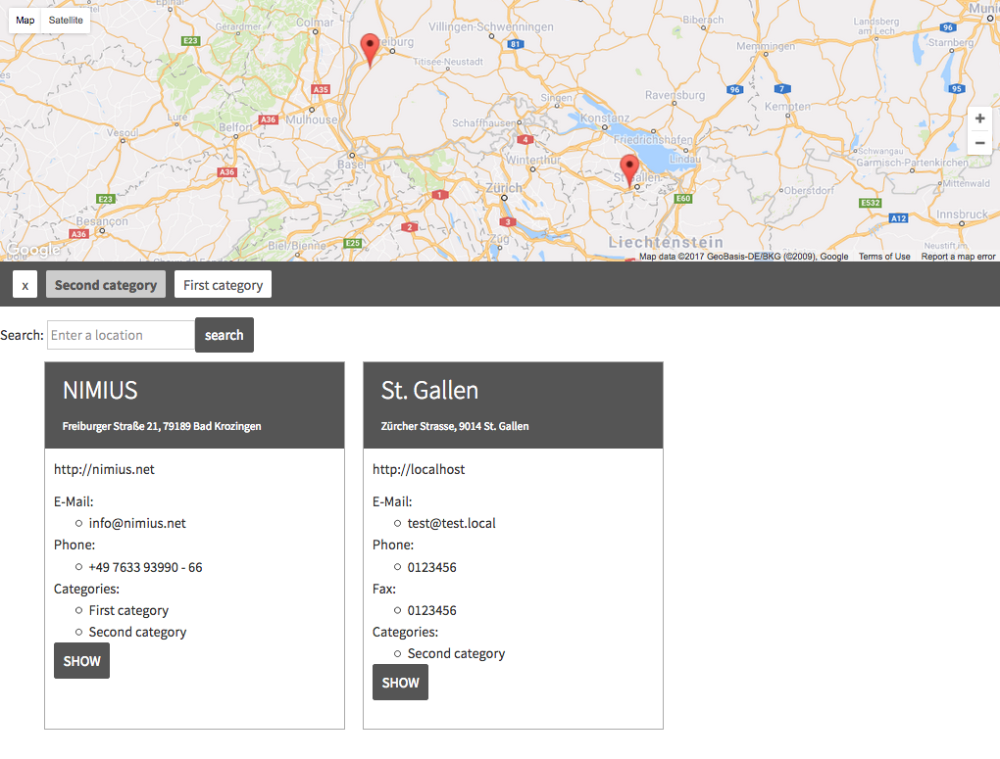

.. ==================================================
.. FOR YOUR INFORMATION
.. --------------------------------------------------
.. -*- coding: utf-8 -*- with BOM.

.. include:: Includes.txt

What does it do?
================

Location Manager is a TYPO3 Extension that allows displaying multiple Locations and additional Information about those
Locations on a Map. It uses geocoding_ to dynamically find the correct coordinates based on its address.

.. _geocoding: https://typo3.org/extensions/repository/view/geocoding

    Example of location_manager frontend

Installation
============

The extension can be installed through the TYPO3 Extension Repository (TER) or using the composer package `typo3-ter/location_manager`.
Developers may also clone the source code directly from github_. Note, that the extension directory must be named `location_manager`.

We strongly recommend also installing the extension geocoding_ to enable automatic Geocoding.

.. _github: http://github.com/nimius/location_manager
